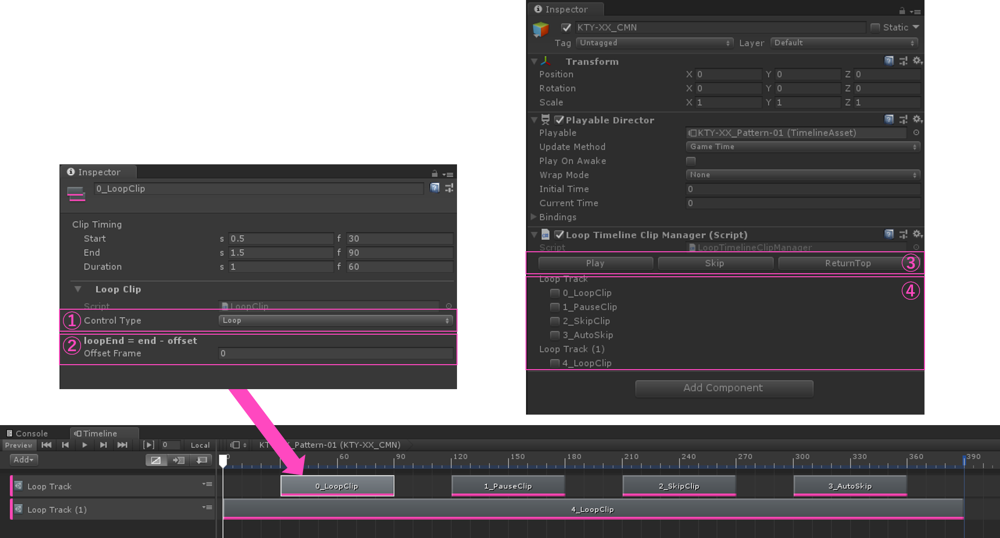

# TimelineLoop
Timelineの任意位置でループさせるための拡張

# LoopTrackの使い方

## 1. 概要
LoopTrackはTimeline全体の動きを制御するために作成したCustomTrackである.  
また,LoopTrackはEditorが**再生モードでないと動作しない**.  
設定する項目が複数存在するので,以下では各項目の意味と動作への影響を示す.  
さらに,使用する際の手順も示す.

## 2. 項目説明

図1 キャプチャー画像

   

図1中の①～④(以下,「図1中の」は省略)が設定する項目である.各項目の説明を以下に示す.  
①：Timelineを制御する方法の種類  
　　種類は以下のものがある  
　　　Loop：クリップの終端からオフセットだけ前に到達するとクリップの先頭に戻り,フラグを受け取るとループを抜けてクリップの終端から開始する ※1,2  
　　　Pause：クリップの先頭で一時停止して,フラグを受け取るとクリップの終端から開始する  
　　　Skip：フラグを受け取るとクリップの終端から開始する  
　　　AutoSlip：クリップの先頭に到達すると自動的にクリップの終端から開始する  

②：ループの終端のオフセット値  
　　ループクリップの場合のみ,ループの終端をオフセットするフレーム数  
　　オフセット値は30FPSにおけるフレーム単位である

③：Timelineの制御をするボタン群  
　　エディターが再生中の時のみActiveになり,種類は以下のものがある  
　　　Play：Timelineの再生開始を行うボタン(TimelineWindowの再生ボタンとほぼ同じ)  
　　　Skip：ループやポーズから抜け出すために使う,①の説明におけるフラグを立てるボタン  
　　　ReturnTop：Timelineを停止して先頭に戻るボタン

④：各クリップの再生済みフラグ  
　　使用したいクリップだけ再生開始前にfalseに設定しておくことで,動作するクリップを選択できる  

③,④を持つコンポーネント(LoopTimelineClipManager)は,LoopTrackにクリップを追加した時点で**自動付与**される.  
また,トラックをすべて削除すると**自動でRemove**される.  

※1：別トラックのループ範囲内にあるクリップ(図1中の0～3番のクリップ)で,かつTimeline再生開始時点で④の再生済みフラグがfalseのものは,  
囲っているループクリップ(図1中の4番クリップ)が先頭に戻るときにフラグがfalseになる  
※2：ループの終端がTimelineの終端と同じとき,ループせずにTimelineが終了してしまう

## 3. 使用手順
1. トラックに使いたいようにクリップを配置して①,②を設定しておく
2. PlayableDirectorのPlayOnAwakeをfalseにしておく
3. エディターを再生モードにする
4. ④で再生させたいクリップだけトグルをfalseにする(他はtrueにしておく)
5. ③のPlayボタンを押す(TimelineWindowの再生ボタンでもOK)
6. ループやポーズなどから抜けたいときに③のSkipボタンを押す ※3
7. 再度再生したい場合は③のReturnTopボタンを押して,4～6を行う

※3：別トラックのループの範囲内で処理を行っているために抜けられない場合は,④における該当クリップのトグルをtrueにすることで抜けられる
